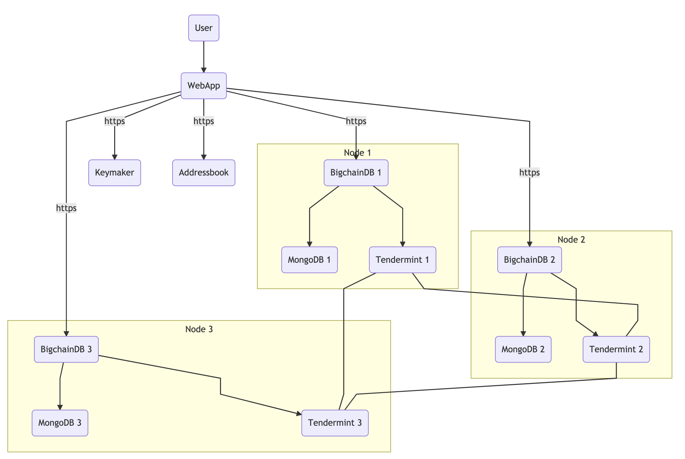

# Keygenerator webservice

RESTfull webservice that generates reproducable Ed25519 keypairs to use in (amongst others) BighChainDB.

## Install

* Make sure you have NodeJS (>= 10) installed 
* Clone this repo: `https://github.com/stefanvangastel/keymaker.git`
* Enter the project: `cd keymaker`
* Run `npm install`
* Run `node index.js`

## Usage

> **Note**: Providing a `X-Forwarded-Remote-User` via `curl` is just for testing, in production situations you should place this API behind a reverse-proxy that handles SSO and sets the `X-Forwarded-Remote-User`.

In the following examples, we assume our username is `john` and our collegue's username is `luke`.

### Generate my key


Request
```
curl -X GET \
  http://localhost:3000/generate/ \
  -H 'X-Forwarded-Remote-User: john'
```

Response
```
{
    "username": "john",
    "keypair": {
        "publicKey": "C4TPf87pZcFMoFVVLAS3ws5qtT1hTwMXTToG1u1d877X",
        "privateKey": "E8qyQ8DU5fL1JLjPwLia3qM8B1ND8oWnVXGaJLD27YQW"
    }
}
```

### Retrieve other users key

Request
```
curl -X GET \
  http://localhost:3000/generate/luke \
  -H 'X-Forwarded-Remote-User: john'
```

Response
```
{
    "username": "luke",
    "keypair": {
        "publicKey": "2b8xmhi3qmHk72F2KY18AQnM8FXioKiadyQYtiUwndJQ"
    }
}
```

## Context



> Source: [https://mermaidjs.github.io/mermaid-live-editor](https://mermaidjs.github.io/mermaid-live-editor/#/edit/eyJjb2RlIjoiZ3JhcGggVERcblxuVShVc2VyKSAtLT4gQShXZWJBcHApXG5cbkEgLS0gaHR0cHMgLS0-IEsoS2V5bWFrZXIgQVBJKVxuQSAtLSBodHRwcyAtLT4gQyhBZGRyZXNzYm9vayBBUEkpXG5cbkEgLS0gaHR0cHMgLS0-IEIxKEJpZ2NoYWluREIgMSlcbkEgLS0gaHR0cHMgLS0-IEIyKEJpZ2NoYWluREIgMilcbkEgLS0gaHR0cHMgLS0-IEIzKEJpZ2NoYWluREIgMylcblxuc3ViZ3JhcGggQmlnY2hhaW5EQiBOb2RlIDNcbkIzIC0tPiBNMyhNb25nb0RCIDMpXG5CMyAtLT4gVDMoVGVuZGVybWludCAzKSBcbmVuZFxuc3ViZ3JhcGggQmlnY2hhaW5EQiBOb2RlIDJcbkIyIC0tPiBNMihNb25nb0RCIDIpXG5CMiAtLT4gVDIoVGVuZGVybWludCAyKSBcbmVuZFxuc3ViZ3JhcGggQmlnY2hhaW5EQiBOb2RlIDFcbkIxIC0tPiBNMShNb25nb0RCIDEpXG5CMSAtLT4gVDEoVGVuZGVybWludCAxKSBcbmVuZFxuXG5UMSAtLS0gVDJcblQxIC0tLSBUM1xuVDIgLS0tIFQzXG5cbiIsIm1lcm1haWQiOnsidGhlbWUiOiJkZWZhdWx0In19)